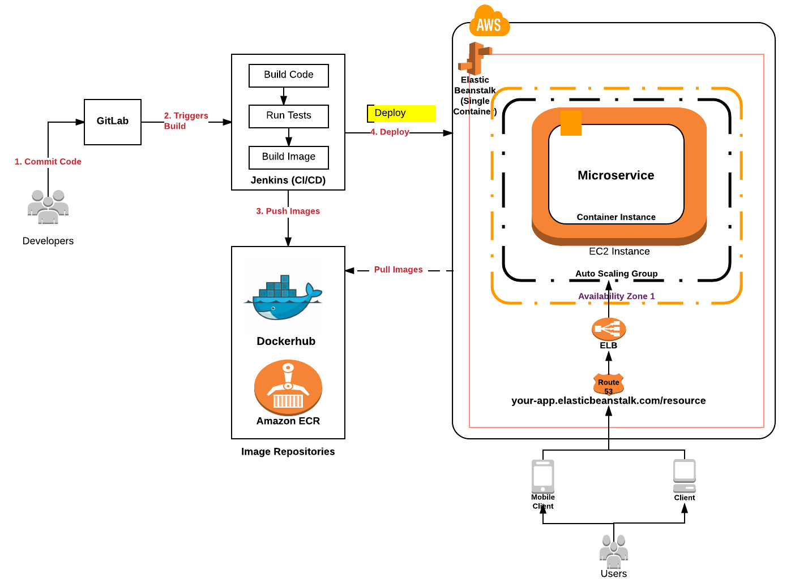

# Continuous Delivery of Microservices on AWS using AWS Elastic Beanstalk

[AWS Elastic Beanstalk](https://aws.amazon.com/documentation/elastic-beanstalk/) service can be used to deploy and scale applications and services (from docker containers) developed with Java, .NET, PHP, Nodejs, Python, Ruby, Go etc on servers such as Apache, Tomcat, Nginx etc. Docker containers provide the flexibility of selecting one's runtime environment of choice including platform, programming language, app/services dependencies, and also, configuring the environment appropriately. All one is required to do is simply push the docker image to the image repository, and deploy the container. Elastic Beanstalk service, then, takes care of different aspects of deployment such as capacity provisioning, load balancing, auto-scaling, application/service health monitoring etc.

Docker platform for Elastic Beanstalk has two generic configurations such as following: 
 - Single container Docker
 - Multicontainer Docker

We shall try and cover the use cases for both the configuration types.

## Single Container Docker

Before getting into details of single container docker configurations for Elastic Beanstalk, lets quickly look into the solution architecture for deploying microservices on AWS using AWS Elastic Beanstalk.

### Solution Architecture

Following represents the **solution architecture** of deploying microservices on AWS using AWS Elastic Beanstalk using single container docker configurations.



In the above diagram, pay attention to some of the following:

 1. Code is checked into code repository such as Gitlab
 2. Webhook configured in GitLab triggers the Jenkins job
 3. Jenkins job starts executing which results in following steps:
    - Retrieve the microservice artifacts from Gitlab
    - Build the microservice
    - Run the tests such as unit and integration tests
    - Build the image if all of the above steps are successful
    - Push the image to image repository such as Dockerhub or AWS ECR
    - Deploy using AWS Elastic Beanstalk CLI command 

### Single Docker Container Configuration

Following steps need to be taken to get setup with Elastic Beanstalk to deploy application/services/microservices from docker containers based on single docker container configuration:

 1. Create a Beanstalk application using [AWS console for creating new application](http://console.aws.amazon.com/elasticbeanstalk/home#/newApplication). Pay attention to some of the following while creating the application.
    - Select environment as Web Server environment.
    - On environment type page, select configuration as "Docker" (and not Multi-container Docker) and environment type as "Load balancing, auto scaling"
    - Continue with choosing default in each step. In "Application version", you may choose to upload the Dockerfile or Dockerrun.aws.json. Later, the same Dockerfile or Dockerrun.aws.json can be uploaded using "eb deploy" command as part of Jenkins build post-steps.
 2. Install Elastic Beanstalk command line interface (EB CLI). EB CLI provides a set of commands for creating, updating and monitoring environments from a local repository.
 3. Go to the project folder consisting of Dockerrun.aws.json or Dockerfile (for single docker container configuration). Use "eb init" command to choose some of the following:
    - Region
    - Access key and secret key
    - Select an application (created earlier using EB console). 
    - Select a keypair (one which was selected while creating the application using EB console)

With above steps followed, one should be all set to execute the following command from the project folder.
```
eb deploy
```
Make sure that project folder consists of either Dockerfile or Dockerrun.aws.json. In the code below, image is retrieved from Dockerhub. Note the AWSEBDockerrunVersion as "1". For multi-container configuration, the value becomes "2".
```
{
  "AWSEBDockerrunVersion": 1,
  "Image": {
    "Name": "ajitesh/springboot-web-app",
    "Update": "true"
  },
  "Ports": [
    {
      "ContainerPort": "8080"
    }
  ],
  "Logging": "/var/log"
}
```

## Configure Jenkins Post-steps

Jenkins post-steps can be configured to achieve following:

### Pushing images to Dockerhub; Register task definition; Update ECS

```
# Build the docker image
sudo docker build -t ImageName:tag /var/jenkins_home/workspace/SpringBootApp

# Login into Dockerhub
sudo docker login -u="dockerhubLogin" -p="dockerhubPassword"

# Push docker image into Dockerhub
sudo docker push ImageName:tag

# EB Deploy
eb deploy
```
In above code samples, note some of the following:
 - **ImageName:tag** should be replaced with image such as ajitesh/springboot-web-app:latest. 

