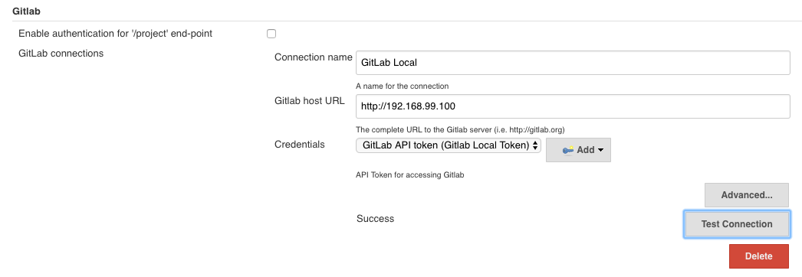
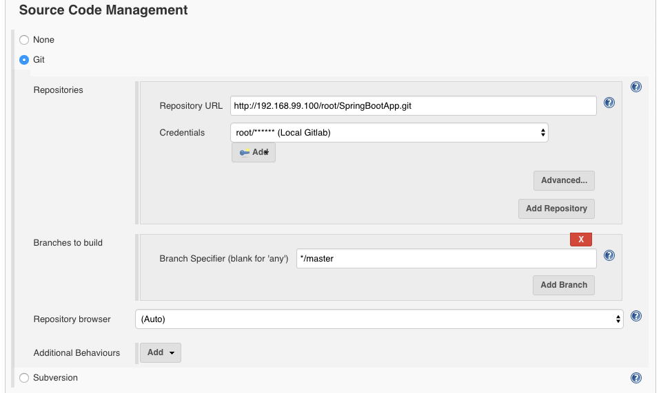
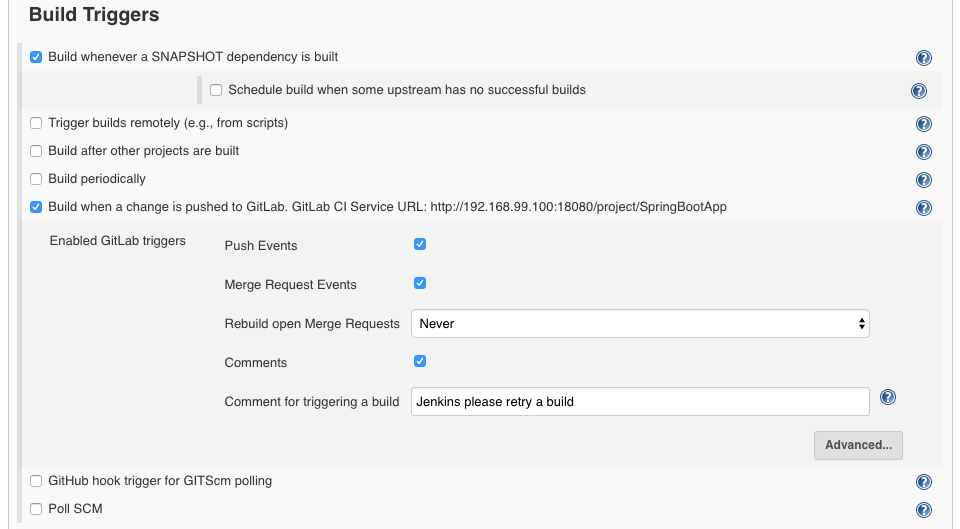

# Set up Jenkins-Gitlab

Following are some of the key aspects of configuring Jenkins and GitLab and integrating them such that an event in GitLab will result in invocation of a Jenkins job using WebHooks.

 - Installing Jenkins Plugins
 - Configuring Jenkins
 - Creating Webhooks in GitLab

## Installing Jenkins Plugins

Following are some of the plugins which is required to achieve the Jenkins/Gitlab integration, building Maven projects etc.

 - Gitlab, git client, git plugin
 - Maven integration plugin
 - You may choose to work with AWS plugins such as AWS ECS, AWS ECR plugins etc; However, the same could be achieved using shell script as a build post-steps.

## Configuring Jenkins

Following needs to be configured within Jenkins for integrating with GitLab:

 - Go to Manage Jenkins/Configure System page
 - Configure Gitlab connections appropriately. The diagram below represents the same.

 - Go to Project dashboard. Click on Configure.
 - Configure "Source Code Management" appropriately as shown in the diagram below.

 - Configure "Build Triggers" appropriately as shown in the diagram below.

## Jenkins/GitLab within Docker Containers

The project was executed with GitLab and Jenkins installed in seperate containers. 
